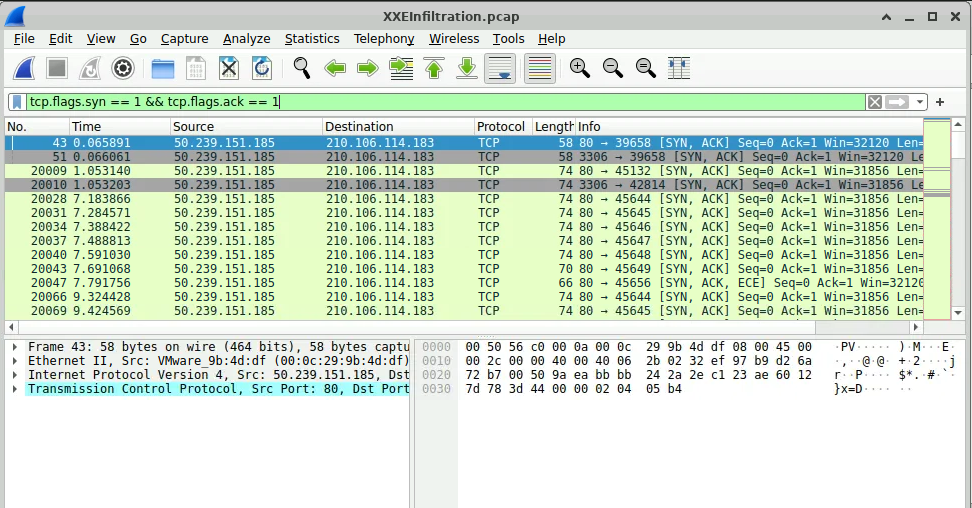
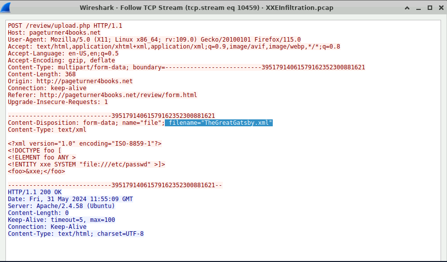
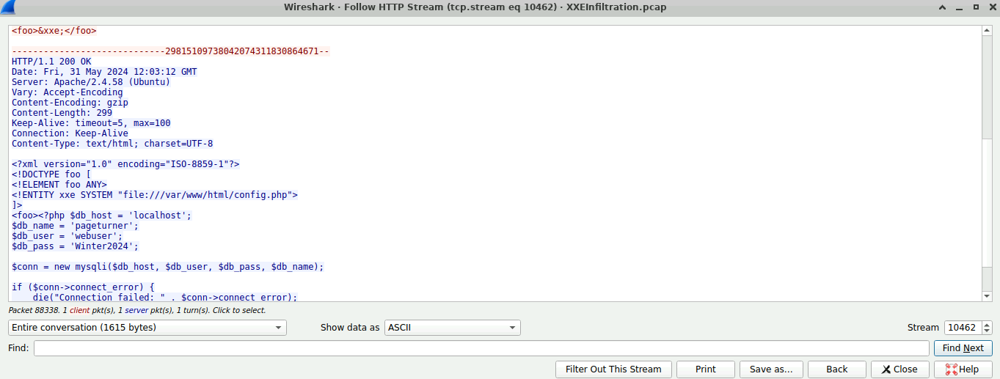
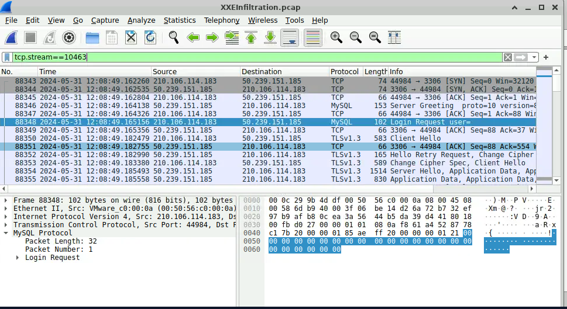
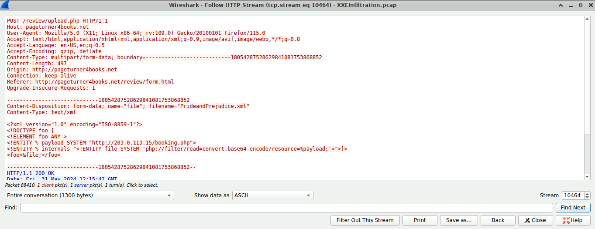
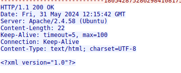
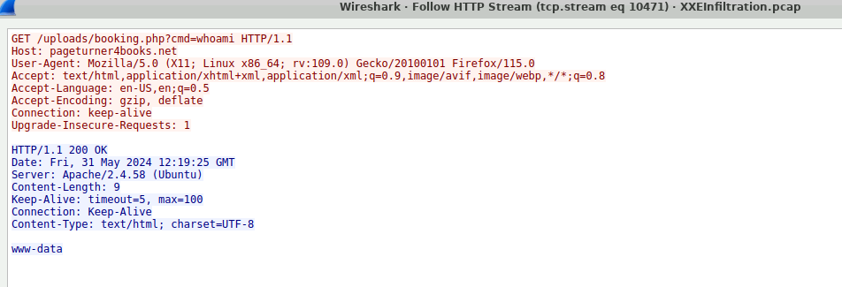

# Evidence and Timeline

Historical incident dates are from the training capture, not the date of this assessment. Packet-list times and server HTTP Date headers are distinguished below; headers have lower precision and can reflect a server clock. All conclusions derive from supplied screenshots, not a newly acquired original PCAP.

| Evidence | Packet / stream | Time basis | Observation | Conclusion |
|---|---|---|---|---|
| E01 | SYN-ACK filtered list | Relative capture time | Victim responds on web and database service ports | Reachable services; scanning context requires surrounding probes |
| E02 | 88306 / 10459 | 2024-05-31 11:55:09.677869 packet-list time | XML external entity targets system account file; reply has no body | File-read attempt, not confirmed disclosure |
| E03 | 88336 request; 88338 response / 10462 | 2024-05-31 12:03:12.267535 request time | Returned configuration exposes database settings | Confirmed configuration and simulated credential disclosure; database name is not username |
| E04 | 88343 TCP SYN; 88348 SSL request / 10463 | 2024-05-31 12:08:49.162260 SYN; 12:08:49.165156 SSL request | Database greeting followed by TLS 1.3 | Post-disclosure connection, not visible authentication success |
| E05/E06 | 88410 / 10464 | 2024-05-31 12:15:42.211581 request time | Remote PHP resource in XML; response only XML declaration | Referenced resource, not proof of installation |
| E07 | 88495 request; response 88497 / 10471 | Request 2024-05-31 12:19:25.546576; response Date 12:19:25 GMT | Upload-directory PHP endpoint accepts whoami and returns www-data | Confirmed command execution as web-service account; no root claim |

## Screenshot exhibits

### E01 — Reachable server ports

### E02 — Initial local-file request

### E03 — Configuration returned by server

Contains simulated historical lab credentials. Preserve as evidence only; do not use them against real systems.

### E04 — TLS database session

### E05/E06 — Remote reference and minimal response

### E07 — Command result

## Provenance and unavailable artifacts
Screenshots were supplied by Ron during this chat. [Manifest](../evidence/manifest.json) records SHA-256 hashes of the received files. These are screenshot hashes, not PCAP hashes. No full capture or server/DB audit logs were independently reviewed in this workspace.

[Achievement link](https://cyberdefenders.org/blueteam-ctf-challenges/achievements/ronrichardsonit/xxe-infiltration/) supplied by Ron. On October 5, 2026, the authenticated lab page independently displayed 7/7 questions and 100% Completed. No separate achievement badge image was downloaded.
