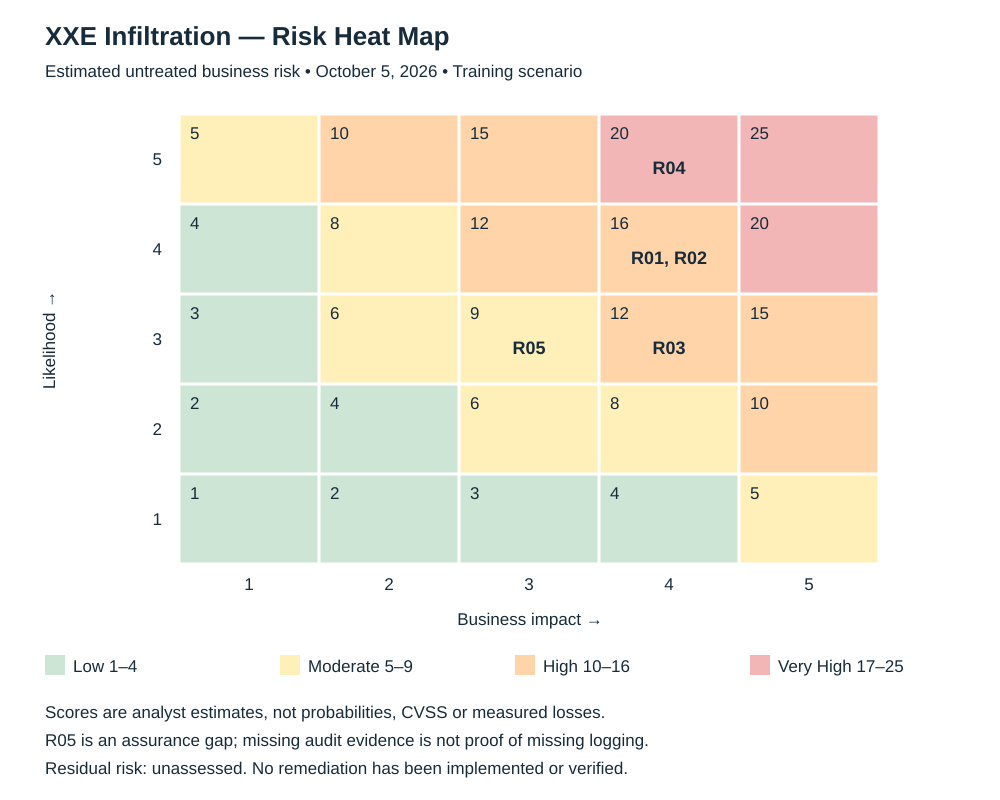

# Risk Register & Remediation Plan

**Prepared by:** Ron Richardson  
**Assessment date:** October 5, 2026  
**Audience:** Business risk owner, security supervisor and IT service owners  
**Status:** Proposed response and treatment plan — no remediation performed

## Management overview
Prioritize containment of confirmed web-service command execution (R04) and rotation of the disclosed database credential (R02). Preserve evidence, then correct XML parsing and upload execution controls before returning the service. Database login success, customer record theft and root access remain unconfirmed.

This is a training case with an assumed customer-facing application handling confidential information. Actual data classification, record volume, privileges, business dependency and regulatory applicability are unknown. No healthcare breach or legal violation is asserted. Named owners below are proposed accountable functions, not assignments accepted by real staff.

## Risk heat map

### Scoring rules and assumptions
Scores estimate **untreated business exposure**, not the likelihood of an event already observed. Likelihood refers to continuation or recurrence if the condition remains untreated: 1 Rare, 2 Unlikely, 3 Plausible, 4 Likely, 5 Highly likely. Impact: 1 Negligible, 2 Limited rework, 3 Material investigation/operational disruption, 4 Major confidentiality/integrity/availability harm, 5 Severe sustained business harm. Impact 5 is not assigned because the inspected evidence does not establish that scale of consequence.

Score = likelihood × impact. Bands: 1–4 Low; 5–9 Moderate; 10–16 High; 17–25 Very High. These are ordinal analyst estimates, not measured probabilities, expected financial loss or technical CVSS scores. The assessment prioritizes response separately from the score: a lower-scored exposed credential still needs immediate rotation.

## Risk register

| ID | Risk scenario and supporting evidence | L | I | Score / rating | Rating rationale | Proposed risk owner |
|---|---|---|---|---|---|---|
| R01 | XML external-entity processing permits local configuration disclosure; E03 confirms returned contents | 4 | 4 | 16 — High | Disclosure is observed; an untreated parsing path could recur and expose additional application secrets | Application service owner |
| R02 | Disclosed database credential could enable unauthorized access if still valid; E03, with subsequent connection E04 | 4 | 4 | 16 — High | Secret exposure is confirmed; successful login and privilege scope are not. Impact assumes access to confidential application data | Database/data owner |
| R03 | Database reachability from the probing source expands the application attack surface; E01/E04 | 3 | 4 | 12 — High | Reachability is observed, but legitimacy of source access and network design are unknown; exploitation remains contingent | Infrastructure service owner |
| R04 | Operational web shell permits commands as the web-service identity; E07 | 5 | 4 | 20 — Very High | Execution is confirmed and continued access is highly plausible if untreated; root access and exact placement method are unproved | Application/platform owner |
| R05 | Insufficient reviewed authentication evidence could delay scoping and leave compromised identity use unresolved; E04 | 3 | 3 | 9 — Moderate | This is an assurance gap: encrypted PCAP does not establish missing server logging. Impact is investigation delay, not proved database loss | Security monitoring owner |

## Risk remediation / action plan

T0 is the hypothetical time an incident owner authorizes response. Targets are proposed **elapsed hours/calendar days**, not approved SLAs or deadlines measured from the portfolio date. Preserve evidence before destructive cleanup. Record actions, approvals and dependencies.

| ID | Proposed treatment / action | Proposed accountable function | Target from T0 | Status | Required evidence for closure |
|---|---|---|---|---|---|
| R04 | Preserve volatile/server evidence; isolate service; remove unauthorized shell through trusted recovery; prevent execution from upload locations; constrain service permissions | Incident response lead with platform operations | Contain within 4 hours; verified recovery before return to service | Proposed — not started | Incident scope reviewed; trusted deployment validated; shell endpoint unavailable; synthetic upload cannot execute; legitimate application works |
| R02 | Revoke/rotate exposed database identity; review downstream use and grants; introduce managed secret delivery and least privilege | IAM lead with DBA | Revoke/rotate within 4 hours; scope/grants review within 1 day; secret-handling improvements within 7 days | Proposed — not started | Old secret denied; approved replacement works; rotation audit and entitlement review accepted; authentication outcomes reviewed |
| R01 | Disable external entity/DTD resolution as supported by parser; remove unnecessary file/network resolution; add negative regression checks | Application engineering lead | Correct and retest before return to service; proposed maximum 2 days | Proposed — not started | Authorized synthetic local/remote entity reads rejected; legitimate XML processed; code and parser configuration reviewed |
| R03 | Review approved DB access paths; restrict sources to application tier and controlled management; retain TLS | Network lead with DBA | Review/restrict within 1 day; validate before return to service | Proposed — not started | Unauthorized source denied; approved app/management paths work; firewall rule owner and flow evidence accepted |
| R05 | Obtain and correlate database audit, application and endpoint records; validate time synchronization and abnormal identity/source alerts | Security operations lead with DBA | Initial log review within 1 day; monitoring validation within 7 days | Proposed — evidence review pending | Reviewer can trace synthetic authentication success/failure to identity, source and time; protected log retention and alert test accepted |

## Residual risk and acceptance
**Current residual risk: unassessed for all five risks.** No risk reduction is credited until implementation evidence, authorized retesting and functionality checks are reviewed. Do not mark an item closed because an action was proposed or a ticket was created.

After validation, reassess likelihood and impact using actual business scope. The business risk owner signs any remaining-risk acceptance with rationale, compensating controls, expiry and review date. The incident owner records return-to-service approval; unresolved execution access prevents release under this proposed response plan. Track overdue approved targets and exceptions at daily incident reviews, then at weekly remediation reviews.

## Evidence boundary
The encrypted database exchange protects confidentiality; it is not itself a security defect. Use authorized server audit evidence for identity accountability rather than proposing routine bulk decryption. Shell installation attribution remains unverified. Closure here is a future evidence requirement, not a claim that fixes were carried out.

[Evidence and timeline](EVIDENCE-TIMELINE.md) · [Executive brief](EXECUTIVE-BRIEF.md)
